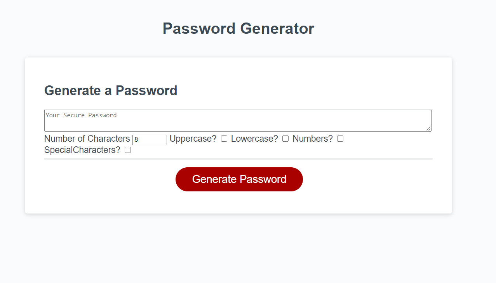

# Passwordgenerator
Password Generator

For this assignment I created a password generator. I started with a rather basic generator and then tried to build in more complexity. I ignored the css and styling as they were not a requirement of the assignment. 

screenshot:

link to active site:
https://ericmalpass.github.io/Passwordgenerator/.

Link to repo:
https://github.com/EricMalpass/Passwordgenerator

recieve alot of support from my study group, tutur, askbcs tuturs, and various websites:

Study Group:

-Li Hua Anderson

-Sam Oberg

-Kelly Dean Mahaffey

Tutur

-Quint Turner

Main websites:

https://www.w3schools.com/

https://docs.github.com/

Using this cheat sheet to access the required characters way easier than typing them all out in an array like [a b c etc]:
https://www.w3schools.com/charsets/ref_html_ascii.asp

Used this document to place the event listeners:
https://developer.mozilla.org/en-US/docs/Web/API/EventTarget/addEventListener
